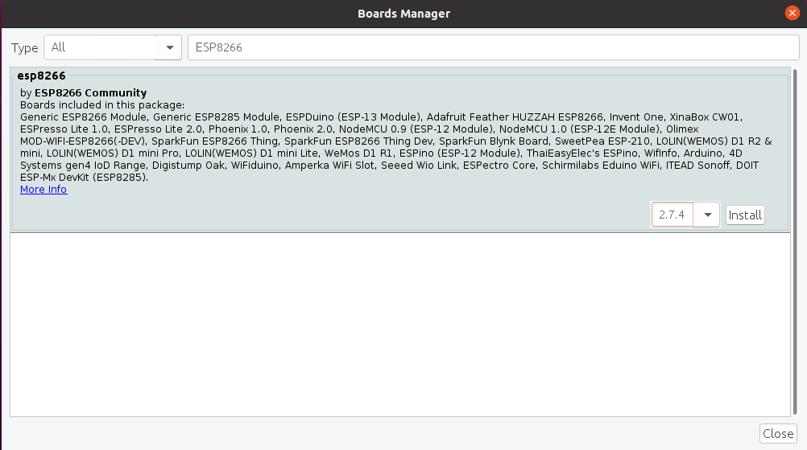

# ittve-ESP8266

**Моделирование проектов на ESP8266**

## Содержание

### [Дружимся c ESP](#%D0%B4%D1%80%D1%83%D0%B6%D0%B8%D0%BC%D1%81%D1%8F-%D1%81-esp)

### [--2. Готовим программатор для передачи кода в микроконтроллеры](#gotovim-programmator-dlya-peredachi-koda)

---

### [Дружимся с ESP](https://habr.com/ru/articles/547330/)

По умолчанию среда IDE настроена только на AVR-платы. Для платформы esp8266 необходимо добавить в менеджере плат дополнительную поддержку.

1) Открываем среду программирования Arduino IDE.

2) В пункте меню File (Файл) выбираем Preferences (Настройки). В окне Additional Boards Manager URLs вводим через запятую адреса 

http://arduino.esp8266.com/stable/package_esp8266com_index.json, 

https://dl.espressif.com/dl/package_esp32_index.json.

3) В пункте меню Tools (Инструменты) -> Board (Плата) выбираем Boards manager (Менеджер плат).

Находим в списке платформы на ESP8266 и нажимаем на кнопку Install (Установить).

---

## Библиография

### [Технологии интернета вещей для любых задач - доступ к моим проектам](https://rightech.io/ru)

### [Rightech IoT Cloud - путь одной команды от «велосипедов» до IoT-платформы](https://habr.com/ru/companies/ric/articles/525494/)

### [Дружимся с ESP](https://habr.com/ru/articles/547330/)

### [Обзор модуля реле для ESP8266-01S](https://robotchip.ru/obzor-modulya-rele-dlya-esp8266-01s-esp-01s/)

 
###### [к содержанию](#soderzhanie)
