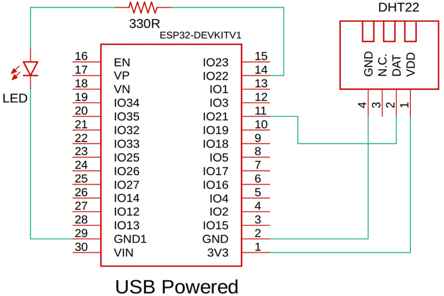
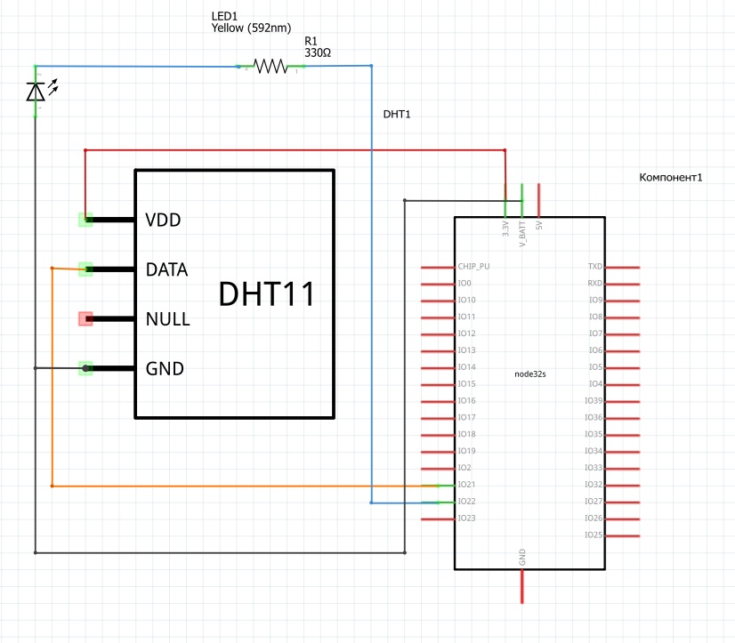
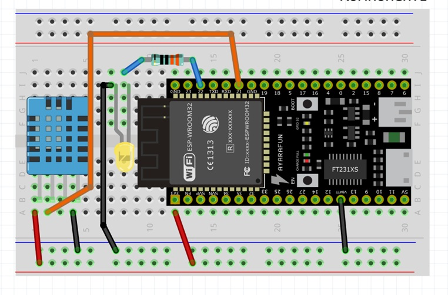
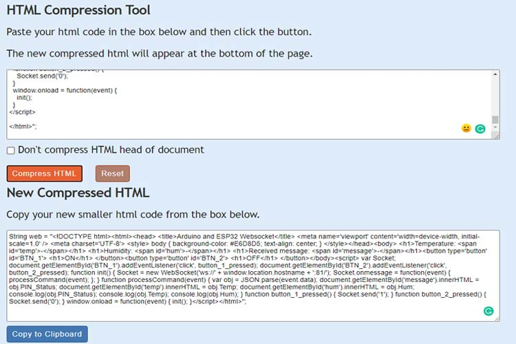
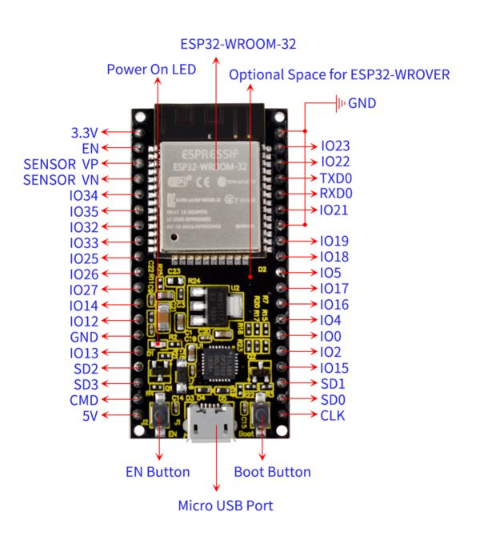
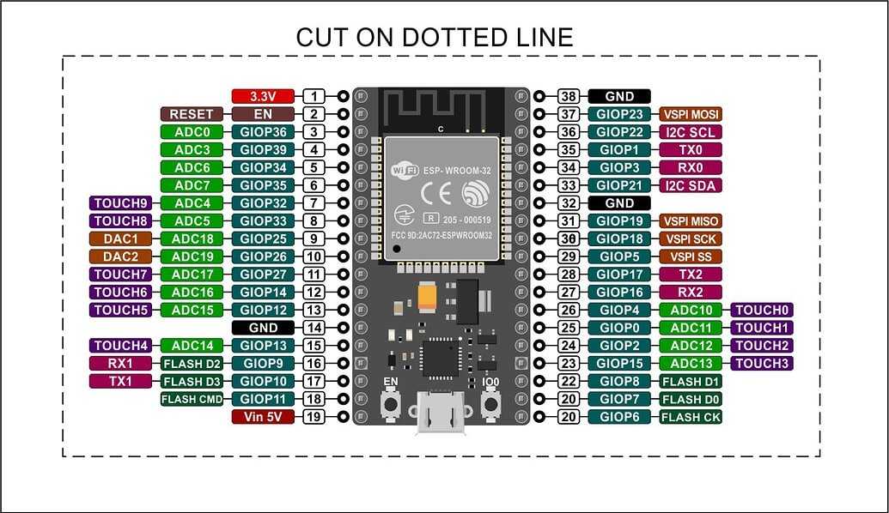
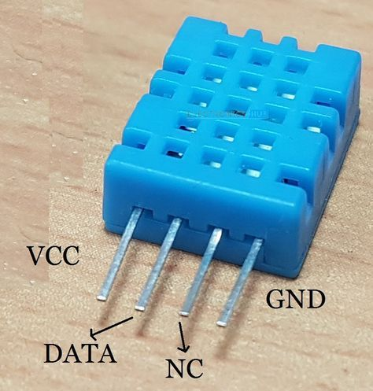

## WebsocketArduino

### "как сделать сокет сервер в ардуино"

### Библиография

#### [va1 WebSocket Server with ESP32 and Arduino IDE](https://iotdesignpro.com/projects/websocket-server-with-esp32-and-arduino-ide) 

В этой статье мы построим веб-сервер на ESP32, который будет работать по протоколу связи WebSocket и уведомлять всех клиентов о произошедших изменениях, а веб-страница будет обновляться мгновенно. В дальнейшем, мы сможем использовать сервер WebSocket на ESP32 для стабильной связи между двумя ESP32.







Как вы можете видеть на приведённой выше схеме, «мозгом» этого проекта является плата разработки ESP32. Схема выглядит следующим образом. Мы подключили светодиод к контакту 22 ESP32. Мы также подключили датчик температуры и влажности DHT22 к контакту 21 ESP32. Для тестирования схемы мы будем подавать на неё питание через USB.

***Как работает веб-сервер на базе ESP32?***

Чтобы получить доступ к этому веб-серверу, сначала необходимо ввести IP-адрес этого сервера. На веб-сервере вы можете увидеть данные о температуре и влажности от датчика DHT, а также кнопку переключения светодиода.

Теперь, если вы откроете веб-страницу на других устройствах, вы увидите, что данные датчика DHT автоматически обновляются на других ваших устройствах. Теперь, если вы нажмете кнопку переключения на любом другом устройстве, вы увидите, что на других устройствах изменения происходят одновременно. 

***Код веб-сервера на основе Arduino***

Поскольку это веб-проект, основанный на веб-сервере, код разделён на две части. Фронтенд и бэкенд. Фронтенд — это простая HTML-страница, которую мы будем использовать для тестирования, а для бэкенда мы будем использовать Arduino IDE.

```
<!DOCTYPE html>
<html>
<head>
<title>Arduino and ESP32 Websocket</title>
<meta name='viewport' content='width=device-width, initial-scale=1.0' />
<meta charset='UTF-8'>
 
<style>
  body
  {
     background-color: #E6D8D5;
     text-align: center;
  }
</style>

</head>

<body>
 <h1>Temperature: <span id='temp'>-</span></h1>
 <h1>Humidity: <span id='hum'>-</span></h1>
 <h1>Received message: <span id='message'>-</span></h1><button type='button' id='BTN_1'>
 <h1>ON</h1>
 </button><button type='button' id='BTN_2'>
 <h1>OFF</h1>
 </button>
</body>

<script>
 var Socket;
 document.getElementById('BTN_1').addEventListener('click', button_1_pressed);
 document.getElementById('BTN_2').addEventListener('click', button_2_pressed);
 function init() {
 Socket = new WebSocket('ws://' + window.location.hostname + ':81/');
 Socket.onmessage = function(event) {
 processCommand(event);
 };
 }
 function processCommand(event) {
 var obj = JSON.parse(event.data);
 document.getElementById('message').innerHTML = obj.PIN_Status;
 document.getElementById('temp').innerHTML = obj.Temp;
 document.getElementById('hum').innerHTML = obj.Hum;
 console.log(obj.PIN_Status);
 console.log(obj.Temp);
 console.log(obj.Hum);
 }
 function button_1_pressed() {
 Socket.send('1');
 }
 function button_2_pressed() {
 Socket.send('0');
 }
 window.onload = function(event) {
 init();
 }
</script>
</html>
```
***Преобразование веб-страницы в строку***

Но прежде чем перейти к Arduino, нам нужно преобразовать всю веб-страницу в строку, потому что в Arduino IDE мы будем сохранять и загружать её как строку. Для этого перейдите в [редактор текста](https://www.textfixer.com/html/compress-html-compression.php) и сжать HTML. Это превратит его в строку. Изображение ниже поможет вам лучше понять процесс.



Сжатый HTML-текст:

```

```

НЕ ПОШЛО !!!









#### [https://github.com/jorgechacblogspot/librerias_fritzing](https://github.com/jorgechacblogspot/librerias_fritzing)


#### [va2 Arduino Uno WebSocket](https://arduinogetstarted.com/tutorials/arduino-websocket) 

#### [va3 How to Create an ESP32 Web Server with WebSockets in Arduino IDE](https://lastminuteengineers.com/esp32-websocket-tutorial/)

#### [va4 ESP32 WebSocket Server: Control Outputs (Arduino IDE)](https://randomnerdtutorials.com/esp32-websocket-server-arduino/)

#### [va5 https://www.best-microcontroller-projects.com/esp32-websocket-server.html](https://www.best-microcontroller-projects.com/esp32-websocket-server.html)


