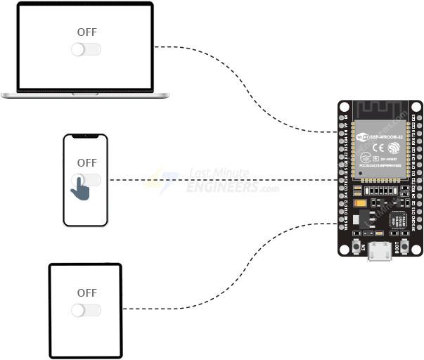

## [HowCreateESP32-WebServer-with-WebSocketsArduinoIDE](https://lastminuteengineers.com/esp32-websocket-tutorial/)

### Что такое WebSocket?

Хотя на первый взгляд название «WebSocket» кажется бессмысленным, концепция, лежащая в его основе, на самом деле довольно проста, и вы сможете быстро разобраться в ней.

WebSocket — это название протокола связи, который обеспечивает двустороннюю (точнее, полнодуплексную) связь между клиентом и веб-сервером. Проще говоря, WebSocket — это технология, которая позволяет клиенту и серверу устанавливать соединение, через которое любая из сторон может отправлять сообщения другой стороне в любое время.

Это отличается от обычного HTTP-соединения, при котором клиент инициирует запрос, сервер отправляет ответ, а затем соединение разрывается. На самом деле WebSocket — это совершенно другой протокол связи: когда клиент устанавливает соединение с сервером, оба конца соединения могут отправлять и получать данные. Таким образом, пока сервер ожидает новые сообщения, все подключённые клиенты также активно прослушивают. В результате сервер может отправлять данные конкретному клиенту или транслировать их всем клиентам без запроса. Кроме того, соединение остаётся активным до тех пор, пока его не закроет клиент или сервер, что обеспечивает непрерывную связь между ними.

### Обзор проекта

Давайте теперь создадим простой проект, в котором мы построим сервер WebSocket с помощью ESP32 для удалённого управления встроенным светодиодом ESP32 через соединение WebSocket.

Мы создадим веб-страницу с переключателем, который позволит пользователям изменять состояние GPIO 2, соответствующего встроенному светодиоду. Веб-интерфейс также будет отображать текущее состояние светодиода.

ESP32 будет активно прослушивать порт 80 на предмет входящих подключений и сообщений WebSocket. Когда пользователь переключает светодиодный индикатор на веб-странице, ESP32 получает сообщение «переключить». Когда ESP32 получает это сообщение, он переключает светодиодный индикатор и немедленно уведомляет всех подключенных клиентов (браузеры), отправляя либо «1» (указывает на включение светодиода), либо «0» (указывает на выключение светодиода). В результате все активные клиенты немедленно обновят статус светодиода на своих веб-страницах.

Чтобы лучше проиллюстрировать, как работает этот проект, мы добавили анимацию, которая показывает, как несколько клиентов подключаются к ESP32 через веб-сокет и обмениваются сообщениями.



Чтобы создать сервер WebSocket, мы будем использовать библиотеку [ESPAsyncWebServer](https://github.com/me-no-dev/ESPAsyncWebServer). Для работы этой библиотеки требуется библиотека [AsyncTCP](https://github.com/me-no-dev/AsyncTCP). К сожалению, ни одна из этих библиотек не доступна для установки в менеджере библиотек Arduino IDE. Поэтому вам придётся установить их вручную.

```
Проверьте подключение к Интернету
Проверьте сетевые кабели, модемы и маршрутизаторы.
Разрешить Microsoft Edge доступ к сети в настройках брандмауэра или антивирусной программы.
Если она уже указана как программа, которой разрешен доступ к сети, попробуйте удалить ее из списка и снова добавить.
При использовании прокси-сервера:
Перейти к меню Microsoft Edge меню > Параметры > Показать дополнительные настройки > Изменить настройки прокси-сервера > локальной сети и снимите флажок "Использовать прокси-сервер для локальной сети".
```


